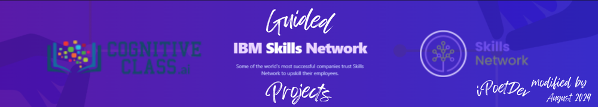

- **<ins>SOURCE</ins>**: 🔗<sub>[](https://github.com/arora-r/chatapp-with-voice-and-openai-outline)</sub>
  - https://github.com/arora-r/chatapp-with-voice-and-openai-outline
  - https://github.com/arora-r/chatapp-with-voice-and-openai
    > This is the shell repository for learners to use in the guided project to make a chatapp using text-to-speech, speech-to-text, and openai
- **<ins>SOLUTION</ins>**: 🔗<sub>[](https://ai-personal-assistant.xs6r134s1i6.us-east.codeengine.appdomain.cloud/)</sub>
  - https://ai-personal-assistant.xs6r134s1i6.us-east.codeengine.appdomain.cloud/
  - 🔗<sub>[](https://github.com/arora-r/chatapp-with-voice-and-openai)</sub>


# Create a Voice Assistant with OpenAI's GPT-3 and IBM Watson

> Local variant of source git and SkillsNetwork (and CognitiveClasses CDE Labs hosting).

> This respository is a demo engineering intiative to showcase the project, product and production skills to rebuild the examplar demo application, in a follow the guuded project from the base source code.

## Introduction

> This repos is a mirror of a **<ins>guided project</ins>** on creating a voice assistant using OpenAI and IBM Watson Speech Libraries for Embed. 
>> The guided project takes you through building a virtual assistant that can take voice input, convert it to text using speech-to-text technology, send the text to OpenAI's GPT-3 model, receive a response, convert it to speech using text-to-speech technology and finally play it back to the user. <br><br>
>> The voice assistant will have a responsive front-end using HTML, CSS, and JavaScript, and a reliable back-end using Flask. <br><br>

### Goal

1.  To build a deep understanding of voice assistants and the skills to create your own AI-powered assistant that can communicate through voice input and output.
2.  To develop a strong foundation in web development using Python, Flask, HTML, CSS, and JavaScript, and a finished full stack application!
3.  To deploy IBM Speech Models and OpenAI Natural Language Processing functionality.

### Topics

- OpenAI
- IBM Watson speech libraries for embed
- Voice assistants
- Python (Flask)
- HTML - CSS - Javascript

## Objectives

- Explain the basics of voice assistants and their various applications
- Set up a development environment for building an assistant using Python, Flask, HTML, CSS, and Javascript
- Implement speech-to-text functionality to allow the assistant to understand voice input from users
- Integrate the assistant with OpenAI's GPT-3 model to give it a high level of intelligence and the ability to understand and respond to user requests
- Implement text-to-speech functionality to allow the assistant to communicate with users through voice output
- Combine all the above components to create a functional assistant that can take voice input and provide a spoken response
- (Optional) Deploy the assistant to a web server for use by a wider audience

## Table of Contents

- [Introduction](#introduction)
- [Objectives](#objectives)
- [Getting Started](#)
- [Project](#project)
- [References](#features)
- [Acknowledgements](#acknowledgements)
- [ChangeLog](#changelog)

## Getting Started

For developers, view [getting-started.md](getting-started.md), to get started with the solution design and deployment flow.

## Project

### Respository Plan

```plaintext
📂 ./ (root)
│ 
├── 📂.github/
│   ├ ... 
│   └──
│ 
├── 📂assets/
│   ├──📂js/
│   │   └── script.js 
│   └──📂css/
│       └── style.css
│ 
├── 📂models/
│   ├── 📂stt
│   │   ├── 📂chuck_var
│   │   ├── Dockerfile
│   │   ├── README.md
│   │   └── prepareModels.sh
│   │  
│   └── 📂tts
│       ├── 📂config
│       ├── Dockerfile 
│       ├── README.md
│       └── prepareModels.sh   
│ 
├── 📂temlates/
│   └── index.html
│ 
├── .env   
│   ...
├── Dockerfile 
├── getting-started.md
│   ...
├── README.md
├── requirements.txt
├── runtime.txt
├── server.py
└── worker.py  

```

<sup>`...`: other common / repository management files per repository template</sup>.

### Branching Strategy

- Main is the main trunk and is mostly protected.
  - Main for project files, repo configs, documentation and other non functional artefctas. 
- Branches used for functionality/code
  - Component / Fearure branch strategies per longer lived branch: component trunks
  - 4 components: ui, backend, api, hosts
  - Useful for simple solutions
- Reduce the friction by light branching and light PR/merging effort.

```plaintext
main                                 ui     backend      api    host    deploy
⊕――――――――――――――――――――――――――――――――――――⊕―――――――――⊕――――――――⊕―――――――⊕――――――⊕ 
│                                    ／
├── 🌿 ui  ――――――――――――――――――――――――⊕ ui
│   ├── feature/ui-feature-1
│   ├── feature/ui-feature-2
│   └── ...
│ 
├── 🌿 backend  ――――――――――――――――――――――――⊕ backend
│   ├── feature/backend-feature-1
│   ├── feature/backend-feature-2
│   └── ...
│ 
├── 🌿 api  ――――――――――――――――――――――――――――――――――⊕ api
│   ├── feature/host-feature-1
│   ├── feature/host-feature-2
│   └── ...
│ 
└── 🌿 host  ―――――――――――――――――――――――――――――――――――――――⊕ host
.   ├── feature/api-feature-1
.   ├── feature/api-feature-2
.   └── ...
.
├── ...
└── ...

```

## Acknowledgements

| &nbsp; | &nbsp;&nbsp;&nbsp;  | &nbsp; | 
| :---   | :--- | :---   |
| [](https://skills.network/) | &nbsp; |  [](https://cognitiveclass.ai/courses)

### Learning Path

> - 🔗<sub>[](https://cognitiveclass.ai/learn/integration-of-embeddable-ai)</sub>
> - Powered by: https://skills.network/

### Source Code

> - 🔗<sub>[](https://github.com/arora-r/chatapp-with-voice-and-openai-outline)</sub>
> - © IBM Corporation. All rights reserved.

### Original Author(s)

> #### Talha Siddiqui
> #### [Rohit Arora](https://github.com/arora-r)

### Repo Author

> #### Charles J Fowler
> [](mailto:ipoetdev-github-no-reply@outlook.com "Contact CJ on GItHub email: ipoetdev-github-no-reply@outlook.com") <sup>|</sup> [](https://ie.linkedin.com/in/charlesjfowler "@CharlesJFowler @Linkedin.com") <sup>|</sup> [](https://github.com/ipoetdev "@iPoetDev @GitHub")


### Collaborators

<!-- readme: collaborators -start -->
<!-- readme: collaborators -end -->

### Contributors

<!-- readme: contributors -start -->
<!-- readme: contributors -end -->

### Bots


### Contributors

<!-- readme: bots -start -->
<!-- readme: bots -end -->

## ChangeLog

| Date<sup>1</sup> | Version | Changed By | Change | Activity | 
| :--- | :--- | :--- | :--- | :--- | 
| 2024-07-23  | 0.1 | Charles J Fowler  | Initial version created | Create  | 
<sup>1</sup>: `YYYY-MM-DD`